# DigitalOcean Droplet Architecture

This document explains the architecture of your deployed Strapi + Next.js application on DigitalOcean.

## System Architecture

```mermaid
graph TB
    subgraph Internet
        User[👤 User Browser]
        DNS[🌐 DNS Server]
    end
    
    subgraph "DigitalOcean Droplet"
        subgraph "UFW Firewall"
            Port80[Port 80 HTTP]
            Port443[Port 443 HTTPS]
            Port22[Port 22 SSH]
        end
        
        subgraph "Docker Network: strapi-network"
            Nginx[🔀 Nginx Reverse Proxy<br/>Container]
            NextJS[⚛️ Next.js Frontend<br/>Container<br/>Port 3000]
            Strapi[🚀 Strapi Backend<br/>Container<br/>Port 1337]
            Postgres[(🗄️ PostgreSQL<br/>Database<br/>Container<br/>Port 5432)]
            Certbot[🔒 Certbot<br/>SSL Certificates]
        end
        
        subgraph "Docker Volumes"
            DBData[📦 postgres_data]
            Uploads[📦 strapi_uploads]
            SSL[📦 SSL Certificates]
        end
    end
    
    User -->|DNS Lookup| DNS
    DNS -->|Returns IP| User
    User -->|HTTPS Request| Port443
    User -->|HTTP Request| Port80
    Port80 --> Nginx
    Port443 --> Nginx
    
    Nginx -->|Route /api, /admin, /uploads| Strapi
    Nginx -->|Route / all other| NextJS
    
    NextJS -->|API Calls| Strapi
    Strapi -->|Query/Store| Postgres
    
    Postgres -.->|Persist Data| DBData
    Strapi -.->|Store Files| Uploads
    Certbot -.->|Manage Certs| SSL
    Nginx -.->|Use Certs| SSL
    
    style User fill:#e1f5ff
    style Nginx fill:#90EE90
    style NextJS fill:#61dafb
    style Strapi fill:#8e75ff
    style Postgres fill:#336791
    style Certbot fill:#ff9800
```



## Request Flow

### 1. User Visits Website


### 2. Admin Accesses Strapi


## Container Communication

### Internal Docker Network

All containers communicate via the `strapi-network` bridge network:

```
┌─────────────────────────────────────────┐
│     Docker Network: strapi-network      │
│                                         │
│  ┌────────┐  ┌─────────┐  ┌─────────┐ │
│  │ Nginx  │  │ Next.js │  │ Strapi  │ │
│  │        │  │         │  │         │ │
│  └───┬────┘  └────┬────┘  └────┬────┘ │
│      │            │             │      │
│      └────────────┴─────────────┘      │
│                   │                    │
│            ┌──────┴──────┐            │
│            │  PostgreSQL  │            │
│            └──────────────┘            │
└─────────────────────────────────────────┘
```

**Container Hostnames:**
- `nginx` → Nginx reverse proxy
- `nextjs` → Next.js frontend
- `strapi` → Strapi backend
- `postgres` → PostgreSQL database

**Example:** Next.js connects to Strapi using `http://strapi:1337`

## Port Mapping

### External Ports (Exposed to Internet)

| Port | Service | Protocol | Purpose |
|------|---------|----------|---------|
| 22 | SSH | TCP | Server administration |
| 80 | Nginx | HTTP | Web traffic (redirects to HTTPS) |
| 443 | Nginx | HTTPS | Secure web traffic |

### Internal Ports (Docker Network Only)

| Port | Service | Access |
|------|---------|--------|
| 1337 | Strapi | Internal only (via Nginx) |
| 3000 | Next.js | Internal only (via Nginx) |
| 5432 | PostgreSQL | Internal only (Strapi only) |

## Data Persistence

### Docker Volumes


**Volume Locations:**
- `/var/lib/docker/volumes/strapi-app_postgres_data`
- `/var/lib/docker/volumes/strapi-app_strapi_uploads`
- `/var/lib/docker/volumes/strapi-app_certbot_webroot`

## Security Layers


1. **DigitalOcean Firewall** (Optional) - Cloud-level protection
2. **UFW Firewall** - OS-level firewall, only allows ports 22, 80, 443
3. **Nginx** - Reverse proxy, SSL termination, rate limiting
4. **Docker Network** - Container isolation
5. **Application** - Strapi authentication, Next.js security headers

## File Structure on Droplet

```
/opt/strapi-app/
├── .env                      # Environment variables
├── docker-compose.yml        # Container orchestration
├── server/                   # Strapi backend
│   ├── Dockerfile
│   ├── package.json
│   └── src/
├── client/                   # Next.js frontend
│   ├── Dockerfile
│   ├── package.json
│   └── src/
├── nginx/
│   ├── nginx.conf           # Nginx configuration
│   └── ssl/                 # SSL certificates
└── scripts/
    └── deploy-droplet.sh    # Deployment script

/opt/backups/                # Database backups
└── db_YYYYMMDD_HHMMSS.sql

/home/deploy/                # User home directory
└── backup-database.sh       # Backup script
```

## Environment Variables Flow


## Backup Strategy


## SSL Certificate Renewal


## Scaling Considerations

### Current Setup (Single Droplet)
- **Pros:** Simple, cost-effective, easy to manage
- **Cons:** Single point of failure, limited scalability
- **Best for:** Small to medium traffic, MVP, personal projects

### Future Scaling Options


## Monitoring Points

Key metrics to monitor:

1. **CPU Usage** - `docker stats`
2. **Memory Usage** - `free -h`
3. **Disk Space** - `df -h`
4. **Container Health** - `docker-compose ps`
5. **Application Logs** - `docker-compose logs`
6. **Database Size** - PostgreSQL queries
7. **Response Times** - Nginx access logs
8. **SSL Certificate Expiry** - Certbot status

---

## Quick Reference

### Check System Status
```bash
# All containers
docker-compose ps

# Resource usage
docker stats

# Disk space
df -h

# Memory
free -h
```

### View Logs
```bash
# All services
docker-compose logs -f

# Specific service
docker-compose logs -f strapi
```

### Restart Services
```bash
# All
docker-compose restart

# Specific
docker-compose restart nginx
```

---

This architecture provides a solid foundation for your application with room to scale as your needs grow.
