# GitHub Actions CI/CD Overview

Visual guide to the automated deployment workflow.


## Workflow Paths

### 🚀 Push to `main` Branch → Auto-Deploy

```mermaid
graph LR
    A[Push to main] --> B[GitHub Actions]
    B --> C[Run Tests]
    C --> D{Tests Pass?}
    D -->|Yes| E[SSH to Droplet]
    D -->|No| F[❌ Fail]
    E --> G[Backup Database]
    G --> H[Pull Latest Code]
    H --> I[Rebuild Docker]
    I --> J[Restart Services]
    J --> K[Verify Deployment]
    K --> L{Healthy?}
    L -->|Yes| M[✅ Success]
    L -->|No| N[🔄 Rollback]
```



### 🧪 Pull Request → Auto-Test

```mermaid
graph LR
    A[Create PR] --> B[GitHub Actions]
    B --> C[Lint Code]
    B --> D[Build Strapi]
    B --> E[Build Next.js]
    B --> F[Test Docker]
    B --> G[Security Scan]
    C --> H{All Pass?}
    D --> H
    E --> H
    F --> H
    G --> H
    H -->|Yes| I[✅ Ready to Merge]
    H -->|No| J[❌ Fix Issues]
```



## Deployment Steps Explained

### 1. Code Push
Developer pushes code to `main` branch on GitHub.

### 2. GitHub Actions Triggered
Workflow automatically starts based on push event.

### 3. Setup SSH
Establishes secure SSH connection to Droplet using secrets.

### 4. Database Backup
Creates timestamped backup before deployment:
```bash
/opt/backups/pre-deploy-20231215_143022.sql
```

### 5. Pull Latest Code
Updates code on Droplet from GitHub:
```bash
git pull origin main
```

### 6. Docker Rebuild
Rebuilds Docker images with latest code:
```bash
docker-compose up -d --build
```

### 7. Service Restart
Restarts all services (PostgreSQL, Strapi, Next.js, Nginx).

### 8. Verification
Checks if services are healthy and accessible.

### 9. Cleanup
Removes old Docker images to save disk space.

## Test Workflow Steps

### 1. Backend Testing
- Install dependencies
- Run linting
- Build Strapi
- Test with PostgreSQL

### 2. Frontend Testing
- Install dependencies
- Run ESLint
- Type checking
- Build Next.js

### 3. Docker Build Test
- Test Strapi Docker build
- Test Next.js Docker build
- Use build cache for speed

### 4. Security Scanning
- Scan for vulnerabilities with Trivy
- Upload results to GitHub Security

## Secrets Used

| Secret | Purpose | Example |
|--------|---------|---------|
| `DROPLET_SSH_KEY` | SSH authentication | Private key content |
| `DROPLET_IP` | Server address | `164.92.123.45` |
| `DROPLET_USER` | SSH username | `deploy` |

## Workflow Files

### `.github/workflows/deploy.yml`
- **Trigger:** Push to `main` or manual
- **Duration:** ~3-5 minutes
- **Actions:** Deploy to production

### `.github/workflows/test.yml`
- **Trigger:** Pull requests to `main`
- **Duration:** ~2-4 minutes
- **Actions:** Test and validate code

## Benefits

✅ **Zero-downtime deployments** - Services restart gracefully  
✅ **Automatic backups** - Database backed up before each deploy  
✅ **Rollback capability** - Reverts on failure  
✅ **Security scanning** - Catches vulnerabilities early  
✅ **Consistent deployments** - Same process every time  
✅ **Fast feedback** - Know immediately if tests fail  

## Monitoring Deployments

### GitHub Actions UI
1. Go to repository → **Actions** tab
2. See all workflow runs
3. Click run for detailed logs

### Droplet Monitoring
```bash
# SSH into Droplet
ssh deploy@YOUR_DROPLET_IP

# Check service status
cd /opt/strapi-app
docker-compose ps

# View logs
docker-compose logs -f

# Check recent deployments
git log --oneline -5
```

## Deployment Timeline

```
0:00 - Push to GitHub
0:05 - GitHub Actions starts
0:10 - Tests complete
0:15 - SSH connection established
0:20 - Database backup created
0:30 - Code pulled
1:00 - Docker images building
3:00 - Services restarting
3:30 - Verification checks
4:00 - ✅ Deployment complete
```

## Troubleshooting

### Check Workflow Logs
GitHub → Actions → Click workflow run → Expand steps

### Check Droplet Status
```bash
ssh deploy@YOUR_DROPLET_IP
cd /opt/strapi-app
docker-compose ps
docker-compose logs
```

### Manual Rollback
```bash
ssh deploy@YOUR_DROPLET_IP
cd /opt/strapi-app
git reset --hard HEAD~1
docker-compose down
docker-compose up -d
```

---

**For setup instructions:** See [CICD_SETUP.md](./CICD_SETUP.md)  
**For quick reference:** See [CICD_QUICKREF.md](./CICD_QUICKREF.md)
